<div align="center">

  

  <p align="center">
    <a href="https://github.com/saffronsarb">
      
    </a>
    <a href="https://shooliniuniversity.com">
      
    </a>
    <a href="#-building-intelligent-systems">
      
    </a>
  </p>

</div>

---

### 👨‍💻 Profile Configuration: `saffron.config.json`

```json
{
  "developer": "Saffron Singh",
  "focus": ["AI/ML", "AI Agents", "Software Engineering"],
  "current_work": "Intelligent systems & AI automation",
  "education": "B.Tech CSE — Shoolini University",
  "creed": "Build → Break → Understand → Improve."
}
```

---

## ⭐ Featured Projects

### 01. [AI Enterprise Knowledge Manager](https://github.com/saffronsarb/SDK-OpenAI-7-agents-Project-with-Orchestration-)

A 7-agent hub-and-spoke knowledge management system built with the OpenAI Agents SDK and Pydantic for deterministic, multi-turn execution. (IIT Jammu Summer School 2026)

**Stack:** `Python` • `OpenAI Agents SDK` • `Pydantic v2` • `Multi-Agent Orchestration` • `RAG`  
👉 [**View Repository on GitHub ↗**](https://github.com/saffronsarb/SDK-OpenAI-7-agents-Project-with-Orchestration-)

---

### 02. [FinPilot AI](https://github.com/saffronsarb/FinPilot-AI)

A full-stack finance companion using React, Express, and Google Gemini to convert natural-language expenses into validated database transactions.

**Stack:** `TypeScript` • `React` • `Vite` • `Node.js` • `Express` • `SQLite` • `Google Gemini API` • `Zod`  
👉 [**View Repository on GitHub ↗**](https://github.com/saffronsarb/FinPilot-AI)

---

### 03. [Generative AI & Deep Learning Experiments](https://github.com/saffronsarb/Generative-AI-Saffron-)

Reproducible Jupyter notebooks exploring convolutional autoencoders, image denoising, and foundational machine learning workflows in Python.

**Stack:** `Python` • `Jupyter Notebook` • `Deep Learning` • `Autoencoders` • `Computer Vision`  
👉 [**View Repository on GitHub ↗**](https://github.com/saffronsarb/Generative-AI-Saffron-)

---

### 04. [C++ Programming Foundations](https://github.com/saffronsarb/Safi_cpp_programs)

A collection of C++ implementations focusing on core algorithms, object-oriented programming, and foundational memory mechanics.

**Stack:** `C++` • `Object-Oriented Programming` • `Algorithms` • `Data Structures`  
👉 [**View Repository on GitHub ↗**](https://github.com/saffronsarb/Safi_cpp_programs)

---

## 🧠 Building Intelligent Systems

I am actively developing technical depth at the intersection of machine learning and practical software engineering:

* **Multi-Agent Systems**  
  Building specialized agents coordinated through orchestration and structured handoffs.

* **RAG & Grounded AI**  
  Exploring retrieval-based systems that connect LLM responses to real domain knowledge.

* **Structured AI**  
  Using schemas and validation to make model outputs predictable and application-ready.

* **AI Automation**  
  Exploring event-driven workflows and AI automation with tools such as n8n.

---

## 🛠️ Technical Stack

<div align="center">

**AI & Machine Learning**<br>
    

<br><br>

**Programming & Web Backend**<br>
<a href="https://skillicons.dev">
  
</a>

<br><br>

**Tools & Environments**<br>
<a href="https://skillicons.dev">
  
</a>

<br><br>

**🔭 Exploring Next**<br>
 

</div>

---


## 💡 Engineering Creed

<div align="center">

> *"Build → Break → Understand → Improve."*  
> *"Don't just use AI. **Understand the engineering beneath it.**"*

</div>

---

## 🤝 Connect

<div align="center">

[](https://github.com/saffronsarb)
[](https://www.linkedin.com/in/saffron-singh-851a44415/)
[](mailto:ssaffron533@gmail.com)

<br />

<p align="center">
  <sub>Saffron Singh • B.Tech Computer Science (AI &amp; ML) • Shoolini University, Solan, India</sub>
</p>

</div>
