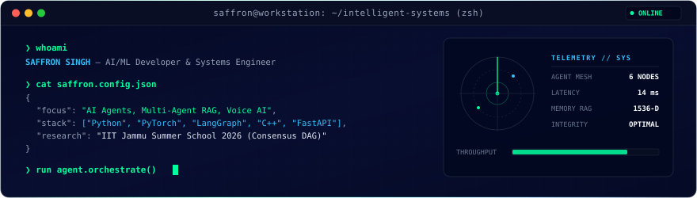

```json
{
  "user": "Saffron Singh",
  "domain": ["AI/ML", "Software Engineering"],
  "location": "Solan, India",
  "creed": "Build -> Break -> Understand -> Improve"
}
```

### > Projects
- [AI Enterprise Knowledge Manager](https://github.com/saffronsarb/SDK-OpenAI-7-agents-Project-with-Orchestration-) — Multi-agent hub-and-spoke orchestration (OpenAI SDK, Pydantic)
- [FinPilot AI](https://github.com/saffronsarb/FinPilot-AI) — Conversational finance companion (React, Express, Gemini)
- [Generative AI Experiments](https://github.com/saffronsarb/Generative-AI-Saffron-) — Convolutional autoencoders and deep learning
- [C++ Foundations](https://github.com/saffronsarb/Safi_cpp_programs) — Low-level programming & core algorithms

### > Current Focus
- Multi-agent systems & structured AI handoffs
- Retrieval-Augmented Generation (RAG)
- Automated pipelines & strict schema validation

### > Technical Stack
- `Python` `C++` `TypeScript`
- `PyTorch` `LangGraph` `FastAPI` `React` 
- `Linux` `Git` `Docker` `n8n`

## 🤝 Connect

<div align="center">

[](https://github.com/saffronsarb)
[](https://www.linkedin.com/in/saffron-singh-851a44415/)
[](mailto:ssaffron533@gmail.com)

<br />

<p align="center">
  <sub>Saffron Singh • B.Tech Computer Science (AI &amp; ML) • Shoolini University, Solan, India</sub>
</p>

</div>
