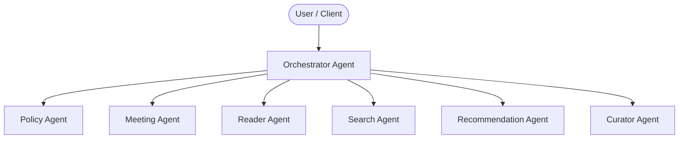
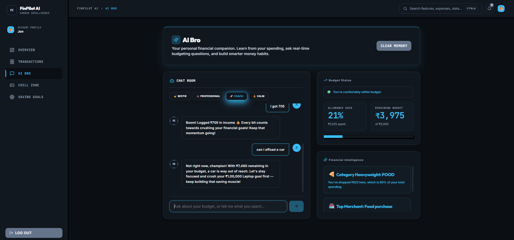

<div align="center">

  

  <p align="center">
    <a href="https://github.com/saffronsarb">
      
    </a>
    <a href="https://shooliniuniversity.com">
      
    </a>
    <a href="#-building-intelligent-systems">
      
    </a>
  </p>

</div>

---

### 👨‍💻 Profile Configuration: `saffron.config.json`

```json
{
  "developer": "Saffron Singh",
  "focus": ["AI/ML", "AI Agents", "Software Engineering"],
  "current_work": "Intelligent systems & AI automation",
  "education": "B.Tech CSE — Shoolini University",
  "creed": "Build → Break → Understand → Improve."
}
```

---

## ⭐ Featured Projects

### 01. [AI Enterprise Knowledge Manager](https://github.com/saffronsarb/SDK-OpenAI-7-agents-Project-with-Orchestration-)

Multi-agent knowledge management prototype developed during the **IIT Jammu Summer School 2026 Internship Program**.

* **7-Agent Hub-and-Spoke Architecture:** Centralized orchestrator dynamically delegating across 6 specialized domain agents (*Policy, Meeting, Reader, Recommendation, Search, Curator*).
* **OpenAI Agents SDK + Pydantic:** Strict structured schemas, deterministic function calling, and session memory for reliable multi-turn execution.
* **Tool-Based Knowledge Workflows:** Document ingestion, contextual retrieval, and human-in-the-loop approval mechanisms.



**Stack:** `Python` • `OpenAI Agents SDK` • `Pydantic v2` • `Multi-Agent Orchestration` • `RAG`  
👉 [**View Repository on GitHub ↗**](https://github.com/saffronsarb/SDK-OpenAI-7-agents-Project-with-Orchestration-)

---

### 02. [FinPilot AI](https://github.com/saffronsarb/FinPilot-AI)

Full-stack student finance companion combining conversational AI with budgeting and transaction management.

* **React + TypeScript Frontend:** Responsive financial dashboard with category spending visualizations, monthly allowance tracking, and recent activity logs.
* **Express + SQLite Backend:** Local-first data persistence, authenticated sessions via JWT & bcrypt, and modular REST API routes.
* **Google Gemini + Structured Validation:** Conversational assistant that converts natural-language expense descriptions into validated transaction records via Zod schemas.

<p align="center">
  <a href="https://github.com/saffronsarb/FinPilot-AI">
    
  </a>
  <br />
  <sub>Conversational financial companion + intelligent budgeting assistance</sub>
</p>

**Stack:** `TypeScript` • `React` • `Vite` • `Node.js` • `Express` • `SQLite` • `Google Gemini API` • `Zod`  
👉 [**View Repository on GitHub ↗**](https://github.com/saffronsarb/FinPilot-AI)

---

### 03. [Generative AI & Deep Learning Experiments](https://github.com/saffronsarb/Generative-AI-Saffron-)

Reproducible experiments exploring deep learning architectures and generative concepts in Python.

* **Autoencoders & Image Denoising:** Convolutional autoencoder implementations for noise reduction, latent feature representation, and image reconstruction.
* **Model Experimentation:** Hands-on notebooks exploring neural representations, data preprocessing, and training pipelines.
* **Foundational Workflows:** Structured Jupyter experiments documenting reproducible machine learning workflows.

**Stack:** `Python` • `Jupyter Notebook` • `Deep Learning` • `Autoencoders` • `Computer Vision`  
👉 [**View Repository on GitHub ↗**](https://github.com/saffronsarb/Generative-AI-Saffron-)

---

### 04. [C++ Programming Foundations](https://github.com/saffronsarb/Safi_cpp_programs)

C++ practice collection focused on programming fundamentals, object-oriented concepts, algorithms, and data structures.

* **Core Algorithms & OOP:** Practical implementations of binary search, bubble sort, class construction, constructors, and array manipulation.
* **Data Structures:** Systematic exercises building foundational fluency in memory mechanics and problem-solving.
* **System Understanding:** Low-level programming exercises supporting a solid conceptual base for higher-level AI engineering.

**Stack:** `C++` • `Object-Oriented Programming` • `Algorithms` • `Data Structures`  
👉 [**View Repository on GitHub ↗**](https://github.com/saffronsarb/Safi_cpp_programs)

---

## 🧠 Building Intelligent Systems

I am actively developing technical depth at the intersection of machine learning and practical software engineering:

* **Multi-Agent Systems**  
  Building specialized agents coordinated through orchestration and structured handoffs.

* **RAG & Grounded AI**  
  Exploring retrieval-based systems that connect LLM responses to real domain knowledge.

* **Structured AI**  
  Using schemas and validation to make model outputs predictable and application-ready.

* **AI Automation**  
  Exploring event-driven workflows and AI automation with tools such as n8n.

---

## 🛠️ Technical Stack

<div align="center">

### AI & Machine Learning
<p>
  
  
  
  
  
</p>

### Programming Languages
<p>
  <a href="https://skillicons.dev">
    
  </a>
</p>

### Web & Backend
<p>
  <a href="https://skillicons.dev">
    
  </a>
</p>

### Tools & Environments
<p>
  <a href="https://skillicons.dev">
    
  </a>
</p>

### 🔭 Exploring Next
<p>
  
  
  
</p>

</div>

---

## 📚 Academic & Coursework

Alongside flagship projects, I maintain codebases from university coursework and collaborative studies:

* 🏛️ [**Class-codes-C**](https://github.com/saffronsarb/Class-codes-C) — Foundational C programming class exercises at Shoolini University.
* 📈 [**financial_advisor-2-**](https://github.com/saffronsarb/financial_advisor-2-) — Second-semester Python financial data exploration coursework.
* 🤝 [**Well-beings**](https://github.com/saffronsarb/Well-beings) — Collaborative digital wellbeing repository (forked study on healthcare app architecture).

---

## 🎯 2026 Roadmap

* [ ] Deploy 1+ full-stack AI applications to public cloud hosting
* [ ] Deepen agent evaluation frameworks and output reliability benchmarks
* [ ] Learn Docker containerization and automated CI/CD pipelines
* [ ] Make first meaningful code contributions to open-source AI projects
* [ ] Continue applied AI/ML research and deep learning experimentation
* [ ] Deepen core software engineering, testing, and system fundamentals

---

## 💡 Engineering Creed

<div align="center">

> *"Build → Break → Understand → Improve."*  
> *"Don't just use AI. **Understand the engineering beneath it.**"*

</div>

---

## 🤝 Connect

<div align="center">

[](https://github.com/saffronsarb)
[](https://www.linkedin.com/in/saffron-singh-851a44415/)
[](mailto:ssaffron533@gmail.com)

<br />

<p align="center">
  <sub>Saffron Singh • B.Tech Computer Science (AI &amp; ML) • Shoolini University, Solan, India</sub>
</p>

</div>
