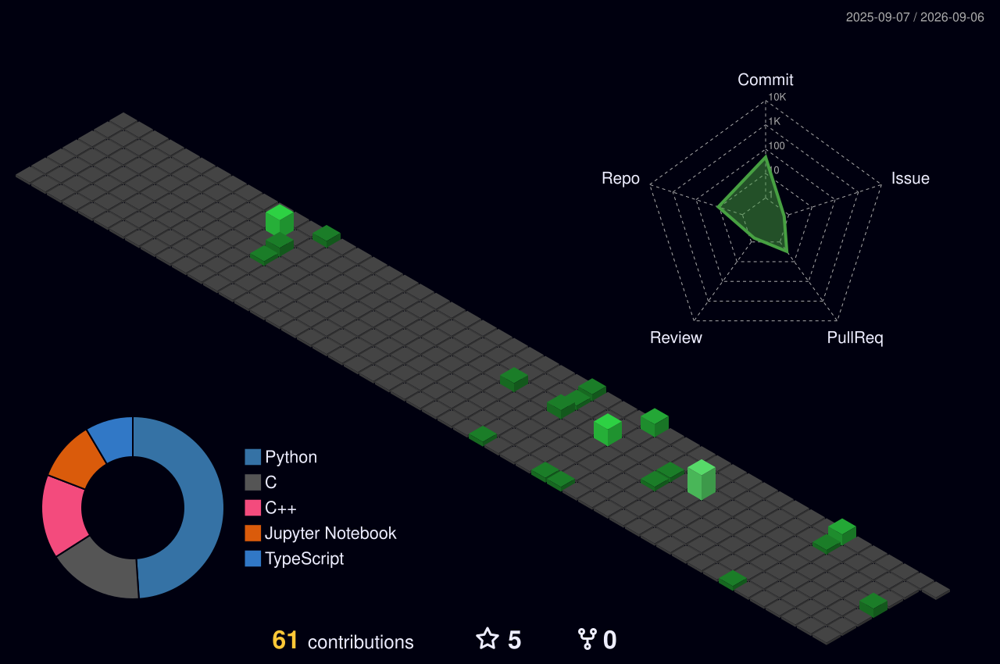

<div align="center">
  
</div>

<!--  -->

<!-- <div align="center">


</div> -->

---

<div align="center">


</div>

---

## 🧑‍💻 About Me

```yaml
name      : Saffron
alias     : saffronsarb
degree    : B.Tech in Computer Science Engineering
role      : Aspiring Software Engineer
interests : [Software Engineering, DSA, Full-Stack Development, Cybersecurity, AI/ML, Open Source]
location  : India 🇮🇳
goal      : Become a Software Engineer at Google, building software that impacts millions.
status    : Actively Learning & Building
mantra    : "Code every day. Push every day. Never stop."
```

---

## 🎯 Career Goal

<div align="center">

```
╔══════════════════════════════════════════════════════════╗
║          🎯 MISSION: SOFTWARE ENGINEER @ GOOGLE          ║
╠══════════════════════════════════════════════════════════╣
║  Build scalable, high-impact software used by millions.  ║
║  Master DSA → System Design → Crack top-tier interviews. ║
╚══════════════════════════════════════════════════════════╝
```

</div>

---

## ⚡ Current Focus

<table>
  <tr>
    <td>📚 <b>DSA & Problem Solving</b></td>
    <td>Solving LeetCode problems daily — arrays, trees, graphs, DP</td>
  </tr>
  <tr>
    <td>💻 <b>Full Stack Development</b></td>
    <td>Building full-stack web applications with React, Node.js, and MongoDB.</td>
  </tr>
  <tr>
    <td>☁️ <b>Cloud Computing</b></td>
    <td>Learning cloud infrastructure and deployment fundamentals</td>
  </tr>
  <tr>
    <td>🤖 <b>AI & Machine Learning</b></td>
    <td>Learning machine learning fundamentals and exploring real-world AI applications.</td>
  </tr>
  <tr>
    <td>🔒 <b>Cybersecurity</b></td>
    <td>Learning ethical hacking, threat detection, and cybersecurity fundamentals.</td>
  </tr>
  <tr>
    <td>🌱 <b>Open Source</b></td>
    <td>Preparing to contribute to open-source projects while building a consistent GitHub activity.</td>
  </tr>
</table>

---

## 🛠️ Tech Stack &amp; Tools

<div align="center">

**Languages**


**Frontend &amp; Backend**


**Tools &amp; Platforms**


**Learning Next**


</div>

---

## 📚 Currently Learning

<div align="center">

| Area | Topics |
|------|--------|
| 🧠 **CS Fundamentals** | Operating Systems · Computer Networks · DBMS · System Design |
| 🌐 **Web Dev** | React · Node.js · REST APIs · Full Stack Architecture |
| ☁️ **Cloud** | Cloud Computing · Deployment · Infrastructure basics |
| 🤖 **AI/ML** | Machine Learning · Neural Networks · Data Science |
| 💻 **DSA** | Advanced Algorithms · Competitive Programming |

</div>

---


<!-- <div align="center">


</div> -->

---

## 📌 Featured Repositories

<div align="center">

| Project | Description | Tech |
| --- | --- | --- |
| 🛡️ [Cyber-Threat-Report-Generator](https://github.com/saffronsarb/Cyber-Threat-Report-Generator) | Generative AI threat detection system with HTML/CSS/JS GUI | `AI` `JS` `HTML` |
| 📚 [DSA-Daily-Practice](https://github.com/saffronsarb/DSA-Daily-Practice) | Daily Data Structures and Algorithms practice | `C++` |
| 🧩 [C-Logic-Building-Exercises](https://github.com/saffronsarb/C-Logic-Building-Exercises) | 200 C++ OOP challenges — linked lists, stacks &amp; queues | `C++` `OOP` |
| 🐍 [Python-Mastery-Core](https://github.com/saffronsarb/Python-Mastery-Core) | Python fundamentals, Machine Learning &amp; RNNs practice | `Python` `ML` |
| 🌐 [Full-Stack-Development-Journey](https://github.com/saffronsarb/Full-Stack-Development-Journey) | Web development learning journey | `Node` `JS` `React` |
| ⚡ [LeetCode-Solutions](https://github.com/saffronsarb/LeetCode-Solutions) | Daily LeetCode solutions &amp; Discrete Math logic | `C++` `Python` |

</div>

---

<!-- <div align="center">


</div>

--- -->

## 🔥 GitHub Streak

<div align="center">


</div>

---


<!-- <div align="center">


</div>

--- -->

## 🌐 3D Contribution Globe

<div align="center">

<a href="https://github.com/saffronsarb">

</a>

</div>

---

## 🎮 Cyber Snake — Live Contribution Animator

> 🐍 A custom Python animation engine renders every GitHub contribution as food for the snake.
> The snake **levels up and transforms** as it eats—changing its color, glow, and head shape through **five distinct phases**. The animation is driven by real GitHub contribution data and regenerated daily using GitHub Actions.

<div align="center">


</div>

---

## 🎯 2026 Goals

<div align="center">

```
╔══════════════════════════════════════════════════════╗
║              MISSION OBJECTIVES — 2026               ║
╠══════════════════════════════════════════════════════╣
║  [✔] Solve DSA problems daily                        ║
║  [✔] Push code on GitHub consistently                ║
║  [ ] Master System Design fundamentals               ║
║  [ ] Build 3+ production-ready full-stack projects   ║
║  [ ] Learn Cloud Computing (AWS/GCP)                 ║
║  [ ] Reach 300+ LeetCode problems solved             ║
║  [ ] Land a top-tier tech internship or placement    ║
╚══════════════════════════════════════════════════════╝
```

</div>

---

## 💬 Dev Quote

<div align="center">


</div>

---

## 🤝 Connect With Me

<div align="center">

[](https://github.com/saffronsarb)
[](https://linkedin.com/in/saffronsarb)
[](https://leetcode.com/saffronsarb)

</div>

---


<div align="center">
  <sub>🛡️ Crafted by <b>Saffron</b> • Powered by GitHub Actions • Always Building, Always Learning</sub>
</div>
